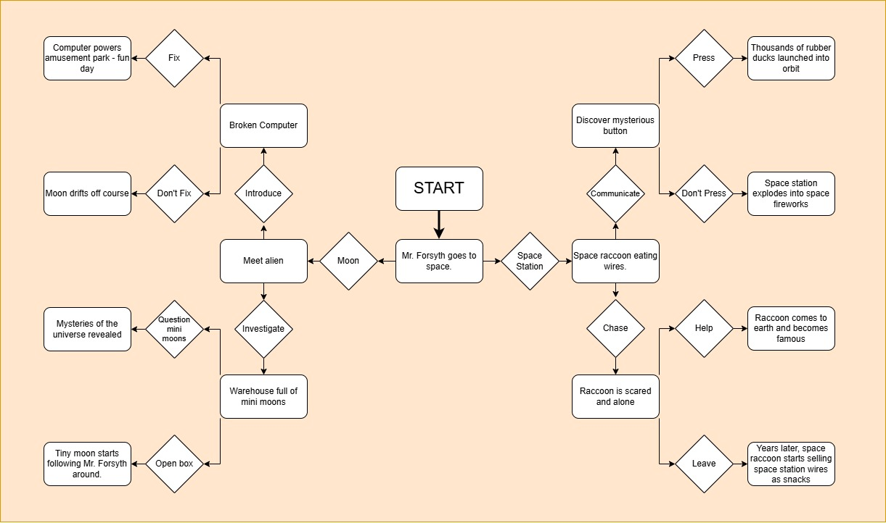

# Activity 3: Choose Your Own Adventure

In this activity, we will walk through how to use selection control structures with user input to create a short choose your own adventure game!

When you have completed the tutorial be sure to also complete the [Extension Activity](#extension-activity-your-own-choose-your-own-adventure)

## 1. Create the Root Folder

Whenever you are creating a new Python project, it is best to stay organized by placing all the files related to the project in the same folder. Create a new folder called `root`.

Inside the folder, create a new `main.py` file.

## 2. Planning Out Your Adventure

In this Choose Your Own Adventure, we will have the user make 3 total choices. This means we will have an initial game state that divides into 2 possibilities after 1 choice, 4 total possibilities after 2 choices, and 8 total possible endings after 3 choices.

To stay organized, it is best to plan out what these possibilities will be before jumping into coding. This can be done with a flowchart!


This is mine, but yours doesn't have to be the exact same.




## 3. Using a Variable to Track the User's Input

With a flowchart created, we will create a variable to keep track of the most recent choice the user gave as an input.

This kind of project will have a pattern of outputting information to the user, then accepting input and so on and so forth. We can reuse this variable for every input we get from the user.

To start we don't have a value and will set it to `None`.

```python
user_choice = None
```

We can also provide the user with their first prompt and get their first input!

**Tip:** For a project like this, with a long section of story, you can use a multi-line string! In Python, a multi-line string can be created with `"""` before and after the text.

```python
story = """
Mr. Forsyth is teaching a computer science class when an alarm suddenly begins blaring throughout the school.

A voice comes over the intercom:

"Attention. This is not a drill. We are short one astronaut."
The classroom falls silent.

A few seconds later, another announcement follows:

"Correction. We are short one astronaut who knows how to troubleshoot technology."

Every student in the room slowly turns to look at Mr. Forsyth.

Five minutes later, he finds himself being escorted onto a rocket.

The rocket launches successfully and reaches orbit.

Mission Control contacts Mr. Forsyth.

"Astronaut Forsyth, we have two important tasks for you. Which would you like to investigate first?"

A : A mysterious signal coming from the Moon.
OR
B : A satellite that has suddenly stopped responding.
"""

print(story)

user_choice = input()
```


At this point, we are expecting the user to either input "A" or "B", so our first selection structure will be based off of that!


## 4. Using Selection Control Structures

Before we actually use a selection structure, let's make our data a little easier to handle. If the user inputs "A" or "a", we want to treat it the same.

**Tip:** Python has a special method for string values that can set them to lowercase: `string.lower()`.

If we take the user's input and set it to lowercase text, then our if statement only needs to check one condition!

```python
user_choice = user_choice.lower()
```

Now we can see if they typed "A" or "B".

```python
if user_choice == "a":
    pass
else:
    pass
```

This is a basic structure that will allow us to check what a user's input was. Right now `pass` acts as a placeholder so we don't get errors.

Our `if` branch will act as our "A" choice, and our `else` branch will act as our "B" choice. We can update the story variable and print the next part of the story based on the choice in each branch.

For brevity’s sake, this code will use an abridged version of the story text, but the full story code can be found at the bottom of the page!

```python
if user_choice == "a":
    story = """
    You find an alien on the moon!
    
    A : Introduce yourself to the alien.
    OR
    B : Ask the alien why they are on the moon.
    """
    print(story)
else:
    story = """
    You find a raccoon munching on wires attached to the space station!
    
    A : Attempt to communicate with the raccoon.
    OR
    B : Chase the raccoon away from the wires.
    """
    print(story)
```

If you run the code now, you will get the next part of the story after making a choice!


## 5. Nesting Selection Structures

Instead of writing out the entire script right now, we can show what it would look like with pseudocode.

Right now, after each choice, the code exits the `if` block. We can nest more if statements inside to keep the story going along each branch. The structure would look something like this:

```txt
START PROGRAM
OUTPUT initial_story
INPUT user_choice
IF user_choice == "a" THEN:
    OUTPUT story_a
    INPUT user_choice
    IF user_choice == "a" THEN:
        OUTPUT story_aa
        INPUT user_choice
        IF user_choice == "a" THEN:
            OUTPUT story_aaa
        ELSE:
            OUTPUT story_aab
        END IF
    ELSE:
        OUTPUT story_ab
        INPUT user_choice
        IF user_choice == "a" THEN:
            OUTPUT story_aba
        ELSE:
            OUTPUT story_abb
        END IF
    END IF
ELSE:
    OUTPUT story_b
    INPUT user_choice
    IF user_choice == "a" THEN:
        OUTPUT story_ba
        INPUT user_choice
        IF user_choice == "a" THEN:
            OUTPUT story_baa
        ELSE:
            OUTPUT story_bab
        END IF
    ELSE:
        OUTPUT story_bb
        INPUT user_choice
        IF user_choice == "a" THEN:
            OUTPUT story_bba
        ELSE:
            OUTPUT story_bbb
        END IF
    END IF
END IF
END PROGRAM
```

Your job is to take this structure, and apply it with the "Choose Your Own Adventure" story you have planned using correct Python syntax.

When you are finished, all 8 story paths should work completely.


## Full Mr. Forsyth Story


```python
user_choice = None

story = """Mr. Forsyth is teaching a computer science class when an alarm suddenly begins blaring throughout the school.

A voice comes over the intercom:

"Attention. This is not a drill. We are short one astronaut."

The classroom falls silent.

A few seconds later, another announcement follows:

"Correction. We are short one astronaut who knows how to troubleshoot technology."

Every student in the room slowly turns to look at Mr. Forsyth.

Five minutes later, he finds himself being escorted onto a rocket.

The rocket launches successfully and reaches orbit.

Mission Control contacts Mr. Forsyth.

"Astronaut Forsyth, we have two important tasks for you."

"Which would you like to investigate first?"

A : A mysterious signal coming from the Moon.
OR
B : A satellite that has suddenly stopped responding.
"""

print(story)

user_choice = input().lower()

if user_choice == "a":
    story = """Mr. Forsyth lands near the source of the signal.

The signal leads him to a giant metal door built into the surface of the Moon.

The door has a keypad.

A message flashes:

HUMAN DETECTED

Then:

FINALLY

The door slowly opens.

Inside is a brightly lit hallway.

At the far end sits an alien drinking coffee.

A : Introduce yourself.
OR
B : Ask why the alien is on the Moon.
"""
    print(story)

    user_choice = input().lower()

    if user_choice == "a":
        story = """The alien seems relieved.

"Excellent. You're the first visitor in 2,000 years."

The alien hands Mr. Forsyth a tablet.

"Can you help me? The station's computer isn't working."

After twenty minutes of troubleshooting, Mr. Forsyth discovers the issue.

Someone accidentally unplugged the entire station.

The alien is embarrassed.

A : Fix the station.
OR
B : Leave it unplugged.
"""
        print(story)

        user_choice = input().lower()

        if user_choice == "a":
            story = """The station powers back on.

The alien reveals it is actually an intergalactic amusement park.

Mr. Forsyth receives a lifetime pass and becomes the first human to ride a roller coaster around Saturn.

THE END
"""
            print(story)
        else:
            story = """Mr. Forsyth leaves.

Three days later, the alien accidentally drifts the Moon six kilometers off course.

Earth scientists are extremely confused.

THE END
"""
            print(story)

    else:
        story = """The alien sighs.

"I'm the caretaker."

It gestures toward a giant warehouse.

Inside are millions of boxes.

Each one is labeled:

SPARE MOON

A : Ask why there are spare moons.
OR
B : Open one of the boxes.
"""
        print(story)

        user_choice = input().lower()

        if user_choice == "a":
            story = """The caretaker explains that moons occasionally wear out and must be replaced.

Mr. Forsyth spends the afternoon learning things humanity was never supposed to know.

THE END
"""
            print(story)
        else:
            story = """Inside the box is a tiny moon.

It immediately escapes and begins orbiting Mr. Forsyth's helmet.

Scientists later name it Forsyth Minor.

THE END
"""
            print(story)

else:
    story = """Mr. Forsyth docks with the satellite.

A maintenance hatch is hanging open.

Inside he discovers a raccoon wearing a space suit.

The raccoon is eating wires.

A : Attempt to communicate with the raccoon.
OR
B : Chase the raccoon.
"""
    print(story)

    user_choice = input().lower()

    if user_choice == "a":
        story = """Surprisingly, the raccoon responds.

"Finally. Someone reasonable."

The raccoon explains that it accidentally launched into space while hiding in a supply crate.

A : Help the raccoon return home.
OR
B : Let the raccoon stay.
"""
        print(story)

        user_choice = input().lower()

        if user_choice == "a":
            story = """The raccoon safely returns to Earth and becomes an international celebrity.

Its autobiography becomes a bestseller.

THE END
"""
            print(story)
        else:
            story = """The raccoon remains in orbit and eventually starts the Solar System's first orbital snack company.

THE END
"""
            print(story)

    else:
        story = """The raccoon flees through the satellite.

During the chase, Mr. Forsyth discovers a hidden room.

Inside is a glowing red button.

A sign reads:

ABSOLUTELY DO NOT PRESS

The raccoon immediately points at the button.

A : Press the button.
OR
B : Stop the raccoon from pressing it.
"""
        print(story)

        user_choice = input().lower()

        if user_choice == "a":
            story = """The button activates a giant holographic sign visible from Earth.

It simply says:

HELLO

Humanity spends decades debating who sent the message.

THE END
"""
            print(story)
        else:
            story = """Mr. Forsyth successfully stops the raccoon.

Later inspection reveals the button would have released ten thousand rubber ducks into orbit.

Earth narrowly avoids a very unusual space age.

THE END
"""
            print(story)
```

# Extension Activity: Your Own Choose Your Own Adventure

Create a new file called `choose_your_own_adventure.py`.

Create your own original Choose Your Own Adventure program. Your program should allow the player to make choices that change the direction of the story and lead to different endings. 

### Requirements

* Create an original story where the player makes **3 choices** before reaching an ending.
* Give the player **2 options (A or B)** at every choice.
* Use **nested `if`/`else` selection structures** so that earlier choices determine which choices the player receives later.
* Create **8 different endings**, so every possible combination of choices leads to its own ending.
* Use `.lower()` so the program accepts both uppercase and lowercase choices.

